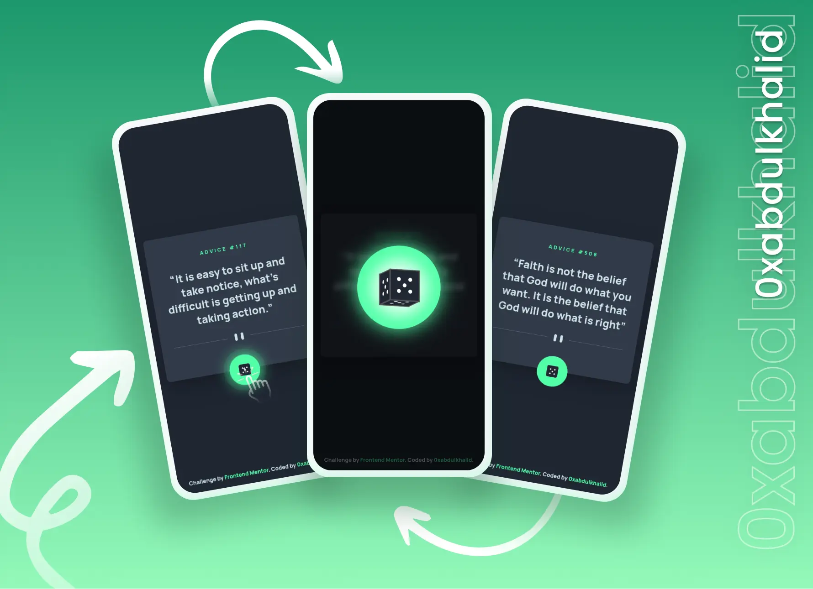

<div align="center">

  

  <h2 align="center">Advice Generator Solution</h2>
  <p align="center">
    <a href="https://www.frontendmentor.io/challenges/advice-generator-app-QdUG-13db"><strong>Frontend Mentor Challenge</strong></a>
    <br />
    <br />
    <a href="https://advice-generator-0xabdulkhalid.vercel.app/">View Demo</a>
    &nbsp;·&nbsp;
    <a href="https://github.com/0xabdulkhalid/advice-generator/issues">Report Bug</a>
    &nbsp;·&nbsp;
    <a href="https://github.com/0xabdulkhalid/advice-generator/issues">Request Feature</a>
  </p>
</div>

<!-- Badges -->
<div align="center">
  <!-- Profiles -->
  <a href="https://www.frontendmentor.io/profile/0xabdulkhalid">
    
  </a> &nbsp;&nbsp;&nbsp;

  <!-- Status -->
  <a href="#">
    
  </a> &nbsp;&nbsp;&nbsp;

  <!-- Difficulty -->
  <a href="https://www.frontendmentor.io/challenges?difficulties=1"  >
    
  </a>

</div>
<br />
<br />

## Preview

<div align='center'>

</div>

<br>


## Links

- |||
  | :----- | :----- |
  | Solution URL: | [To be posted :hourglass_flowing_sand:](#link) |
  | Live Site URL: | [https://advice-generator-0xabdulkhalid.vercel.app/](https://advice-generator-0xabdulkhalid.vercel.app/) |
  |||


<br>


## Pagespeed Insights Score
  
- ||
  | :-----: |
  |  <b>Overall Score 99.3%, Average of Mobile and Desktop</b><br>[ Mobile devices score is only shown below ] |
  | |
  |  |
  | |
  | Check out [**Pagespeed Insights**](https://pagespeed.web.dev/analysis/https-advice-generator-0xabdulkhalid-vercel-app/ne163fkmse?form_factor=mobile) to get live score |
  ||


<br>

## The Challenge

- Users should be able to:
  - View the optimal layout for the app depending on their device's screen size
  - See hover states for all interactive elements on the page
  - Generate a new piece of advice by clicking the dice icon

<br>


## Installation

To set up the Advice Generator Application locally, follow these steps:

1. Clone the GitHub repository to your local machine:

   ```bash
   git clone https://github.com/0xabdulkhalid/advice-generator.git
   ```

2. Navigate to the project's directory:

   ```bash
   cd advice-generator
   ```

3. Install the project's dependencies using npm:

   ```bash
   npm install
   ```

4. Build the project to bundle JavaScript, minify HTML and CSS, and move images:

   ```bash
   npm run build
   ```
5. The build files can be found on `dist` (distribution) directory.

<br>

## Tags

    ES6 Modules | Webpack Bundling | API Integration | Cross-Browser Compatibility | Responsive Design | Code Formatting Guidelines | Automated Deployment with Vercel   

<br>

## Learnings / Notes

- Finded a manual way for trigger/invoke click event for button element by creating a new `MouseEvent` object of type `"click"` and dispatch it on the button element using the `dispatchEvent` method. 
  - This will simulate a click on the button, and any event listeners attached to it will be triggered as if the button were clicked by the user.
  - I have implemented this feature for initializing advice feed once the user visits/open the app.

- Learned to create a 3D Dice by using multiple `div` elements for Dice face along with `preserve-3d`.
  - Each one uses the transform property to rotate or translate the face in 3D space, giving the illusion of a 3D object.
  - It also applies the dice-spin animation, which presumably spins the dice, the overall result is wonderfull!

<br>

## Built With

<div align=center>

  &nbsp;&nbsp; &nbsp;&nbsp; &nbsp;&nbsp; &nbsp;&nbsp; &nbsp;&nbsp;

</div>

<br>

## Tools Used

<div align=center>
  
 &nbsp;&nbsp; &nbsp;&nbsp; &nbsp;&nbsp; &nbsp;&nbsp; &nbsp;&nbsp;

</div>

<br>


## Acknowledgment

- Challenge was provided by [Frontend Mentor](https://www.frontendmentor.io)

<br>

## Let's Connect 👋

<div align=center>

  <a href="https://linkedin.com/in/0xabdulkhalid" >
    
  </a>&nbsp;

  <a href="mailto:0xabdulkhalid@gmail.com" target="_blank">
    
  </a>&nbsp;

  <a href="https://www.frontendmentor.io/profile/0xabdulkhalid" >
    
  </a> &nbsp;
  
  <a href="https://www.github.com/0xabdulkhalid/" >
    
  </a>

</div>

<br>